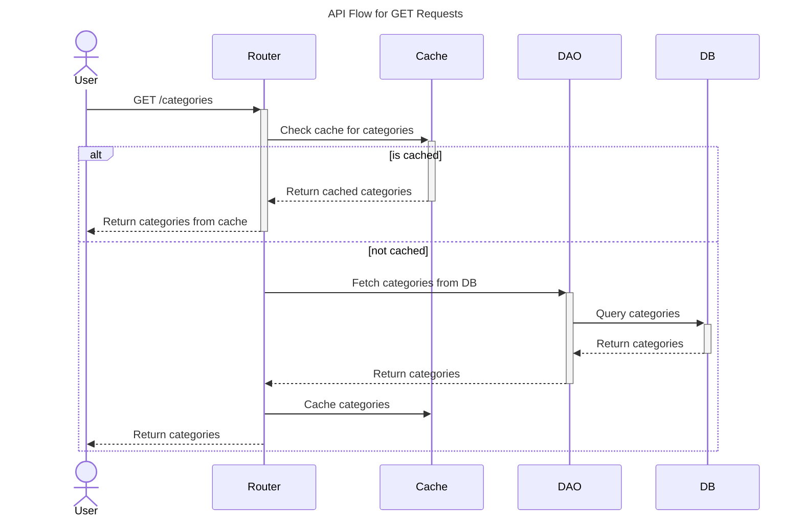
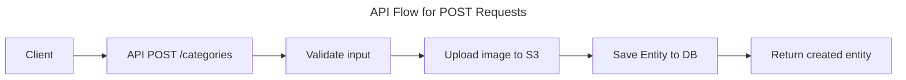
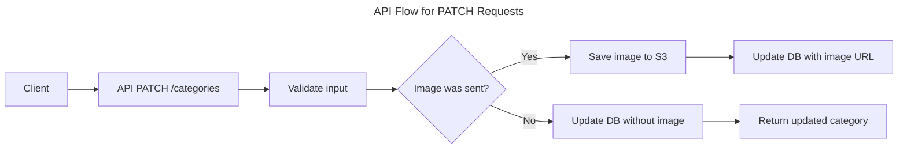
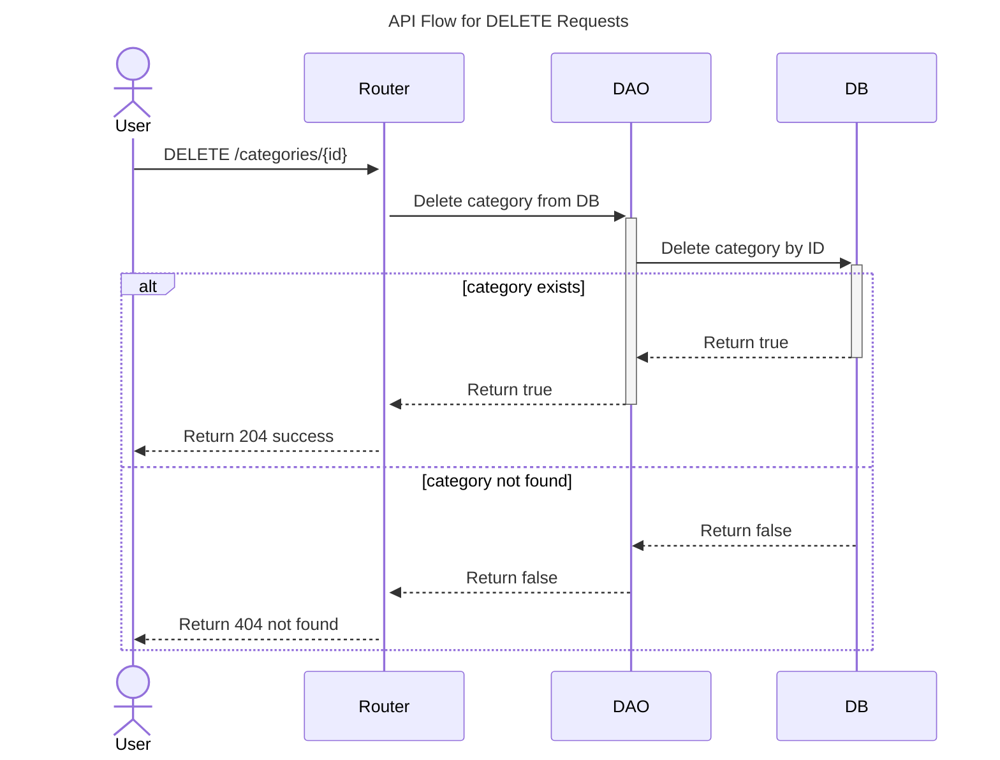
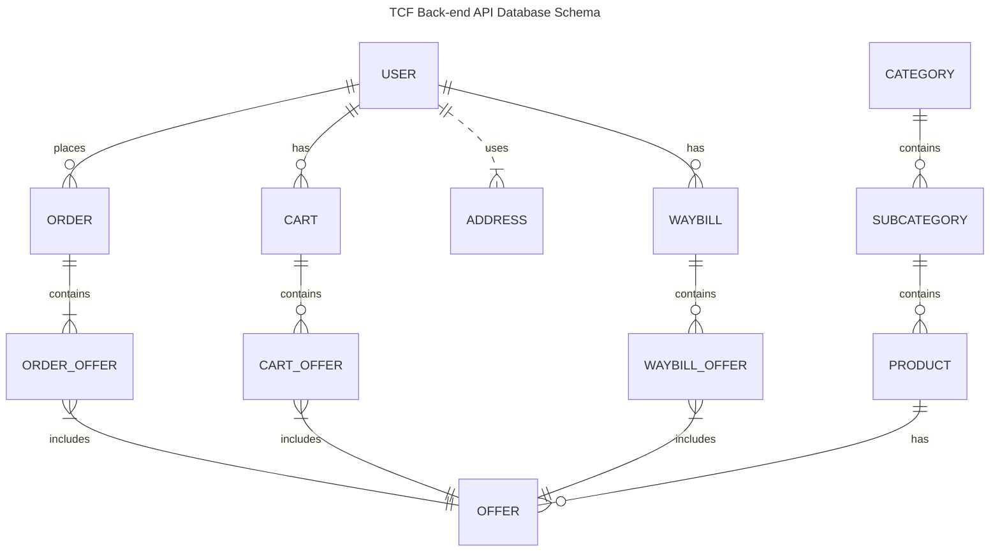
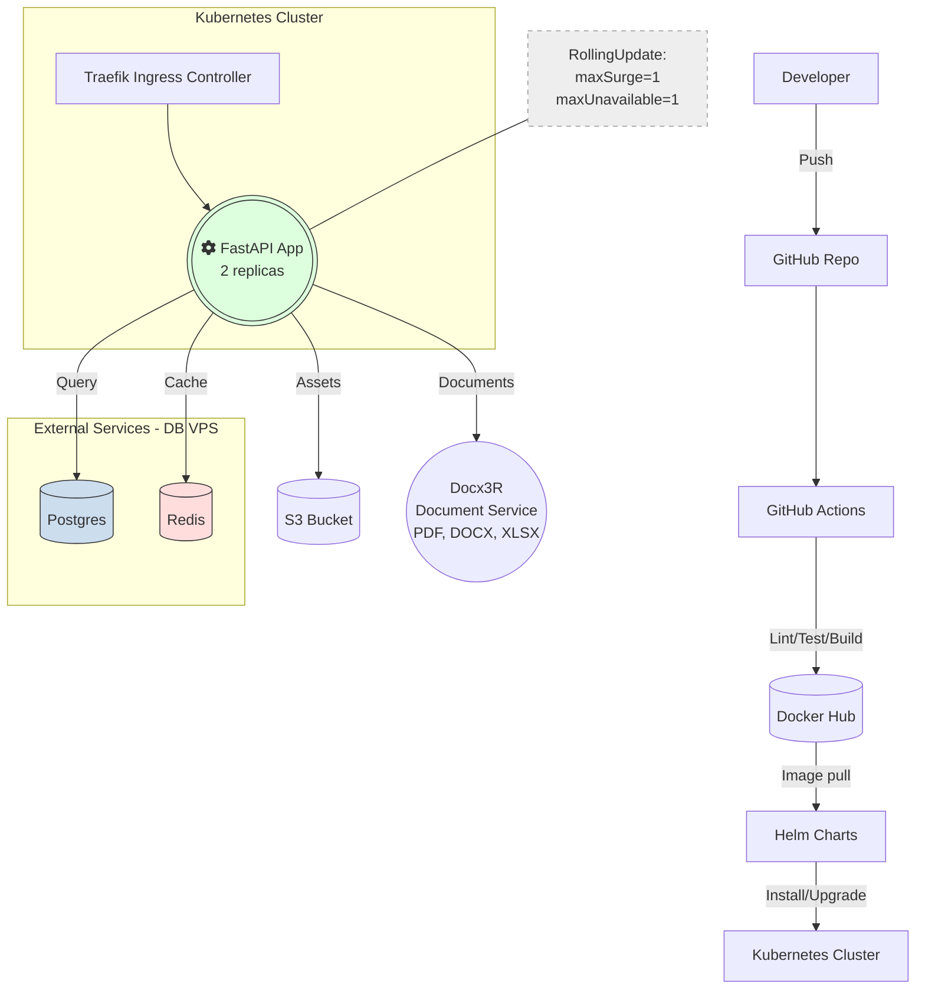

# TCF Back-end API

## Table of Contents


## Overview
### Services Layer
- Postgres - main database (sqlalchemy, alembic, asyncpg)
- Redis - cache, async tasks, etc.
- S3 - file storage for assets (aioboto3)
- SMTP - email service (aiosmtplib)

### API Layer
* `dao` - data access objects, used to interact with the database.
* `services` - business logic, used to interact with the `dao` layer and perform operations on the data.
* `common/deps` - common dependencies, used to inject dependencies into the API endpoints.
* `common/services` - common services: redis, S3, etc. Used in `deps` layer.
* `common/microservices` - common microservices: openai
* `pagination` - using ``fastapi_pagination`` for paginated responses, modified in `utils/pagination`.
### API Endpoints
Endpoints such as `/categories`, `/sub-categories`, `/products`, `/offers` are using the same flow:




PATCH:


DELETE:


### Waybills


### Cart, Orders, and Payments


## DB Schema


### Project Structure with C4


### Deployment Diagram for BE


### Background jobs
1. Celery Stack: celery, redis, flower - complex
2. FastAPI Stack: background tasks, [fastapi mail](https://sabuhish.github.io/fastapi-mail/getting-started/#:~:text=,the%20mail%20defaults%20to%20plain) - simple (using)
3. Dramatiq [link](https://dramatiq.io/guide.html) - simple


## Installation
1. Clone the repository
2. Create a VENV and install packages with UV, python 3.12+
    ```bash
   uv sync --python 3.12
   ```
3. Create a `.env` file in the root directory and add the required environment variables. You can use the `.env.example` as a reference.


## Tests
### General
For infrastructure mock we're using the GitHub `services` to run the dependencies services (Postgres, Redis, S3, SMTP) in a containerized environment.
### Running
To run the tests, execute the following command from the root directory:
```bash
docker compose up -d
coverage run -m pytest -s tests
OR
uv run pytest
```

### Install pre-commit hooks (Linters, formatters, etc.)
```bash
$ pre-commit install
```
And run the hooks on all files (optional), automatically run on every commit:
```bash
$ pre-commit run --all-files
```

## What's new?
### Async DB and DAOs
1. 2 clients: with async with and default one where add commit is allowed
2. Service Layer - business logic
3. DAO unification (TODO)

### HTTP
Formats:
```
1. multipart/form-data - Files (no header)
2. application/x-www-form-urlencoded - Data from forms
3. application/json - JSON (could be header)
```

Working with `multipart/form-data` in FastAPI:
```python
async def post_category(
    payload: Annotated[
        CategoryPostSchema, Depends(CategoryPostSchema.as_form)
    ]
):
    return payload
```
Pydantic:
```python
class CategoryPostSchema(_CategoryBaseSchema):
    @classmethod
    def as_form(cls, name: Annotated[str, Form(...)]) -> "CategoryPostSchema":
        return cls(name=name)
```

HTTPX:
```python
async def test_post_category_creates_category(self, auth_client: AsyncClient):
    auth_client.headers.pop("Content-Type", None)
    files = {
        "image_blob": (
            "candles.webp",
            self.image_blob,
            "image/webp",
        ),
        "name": (None, "candles test category", "text/plain"),
    }


res = await auth_client.post("/categories", files=files)
```
